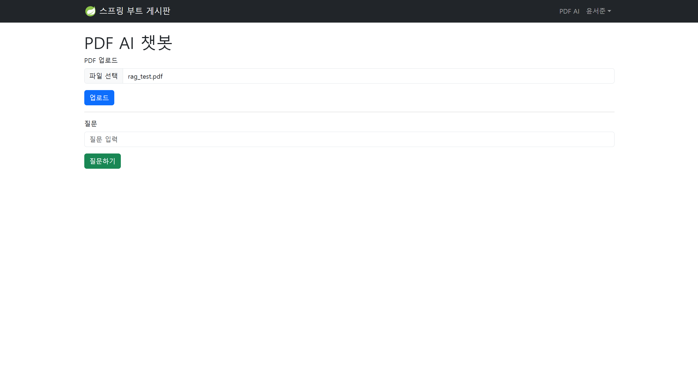
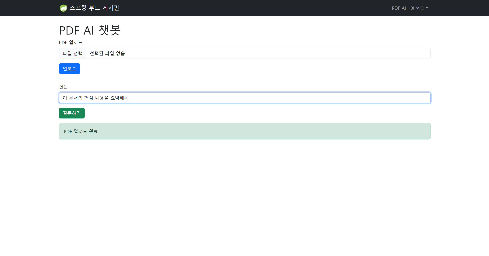
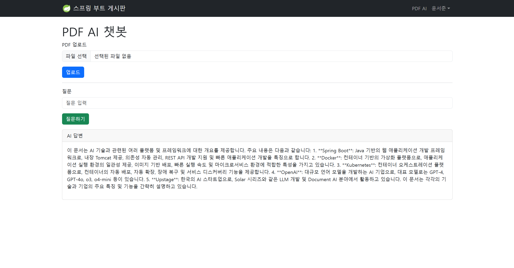
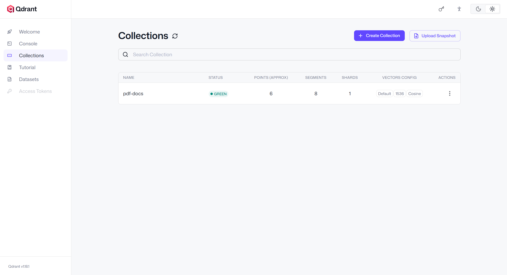
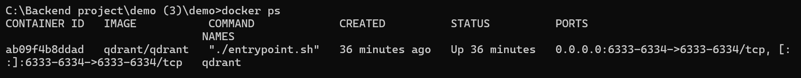

# Spring AI PDF RAG Chatbot

## 프로젝트 소개

Spring AI와 OpenAI API, Qdrant Vector Database를 활용하여 PDF 문서 기반 질의응답(RAG, Retrieval-Augmented Generation) 기능을 제공하는 웹 애플리케이션입니다.

사용자는 PDF 문서를 업로드할 수 있으며, 업로드된 문서는 벡터 데이터로 변환되어 Qdrant에 저장됩니다. 이후 사용자가 질문을 입력하면 Vector Search를 통해 관련 문서를 검색하고 OpenAI LLM을 활용하여 답변을 생성합니다.

---

## 기술 스택

### Backend

* Java 21
* Spring Boot 3
* Spring AI
* Spring Security
* Spring Data JPA

### AI

* OpenAI API
* Embedding Model
* RAG (Retrieval-Augmented Generation)

### Vector Database

* Qdrant

### Database

* H2 Database

### Deployment

* Docker
* Docker Compose

### Frontend

* Thymeleaf
* Bootstrap

---

## 시스템 아키텍처

```text
PDF Upload
   ↓
PDF Chunking
   ↓
OpenAI Embedding
   ↓
Qdrant Vector Store
   ↓
User Question
   ↓
Similarity Search
   ↓
Retrieved Context
   ↓
OpenAI LLM
   ↓
Generated Answer

---

## 주요 기능

### PDF 업로드

* PDF 문서 업로드
* 문서 자동 파싱
* 문서 Chunk 분할

### 벡터 저장

* OpenAI Embedding 생성
* Qdrant Vector Database 저장

### AI 질의응답

* 사용자 질문 입력
* Similarity Search 수행
* 검색 결과 기반 답변 생성

---

## 실행 화면

### PDF 문서 업로드

사용자는 PDF 문서를 업로드하여 벡터 데이터로 변환할 수 있습니다.



---

### 사용자 질문 입력

업로드된 문서에 대해 자연어 질문을 입력할 수 있습니다.



---

### AI 기반 문서 질의응답

사용자 질문에 대해 Vector Search와 OpenAI LLM을 활용하여 문서 기반 답변을 생성합니다.



---

### Qdrant Vector Database

PDF 문서 임베딩 데이터가 Qdrant Vector Store에 저장됩니다.



---

### Docker 기반 실행 환경

Qdrant Vector Database를 Docker 컨테이너 환경에서 운영합니다.



---

## 실행 방법

### Qdrant 실행

```bash
docker compose up -d
```

### 애플리케이션 실행

```bash
./gradlew bootRun
```

### 환경 변수

```text
OPENAI_API_KEY=YOUR_API_KEY
```

---

## 프로젝트 결과

* Spring AI 기반 PDF RAG 챗봇 구현
* OpenAI Embedding을 활용한 문서 벡터화 구현
* Qdrant Vector Database 연동 및 Similarity Search 구현
* PDF 문서 기반 자연어 질의응답 서비스 구현
* Docker 기반 Vector DB 실행 환경 구축
* Spring Boot + AI 서비스 통합 백엔드 개발 경험 확보

---

## 향후 개선 계획

* JWT 인증 적용
* 대화 기록 저장 기능
* 다중 PDF 검색 지원
* 사용자별 문서 관리 기능
* AWS 배포
* LangChain / LangGraph 기반 Agent 기능 추가
